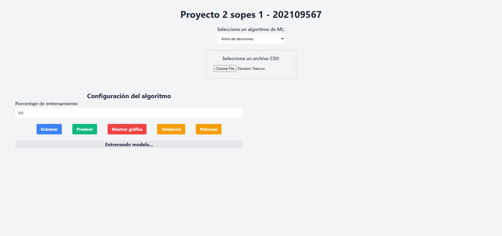
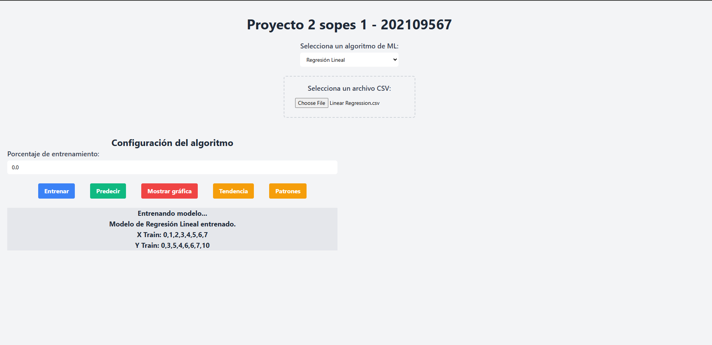
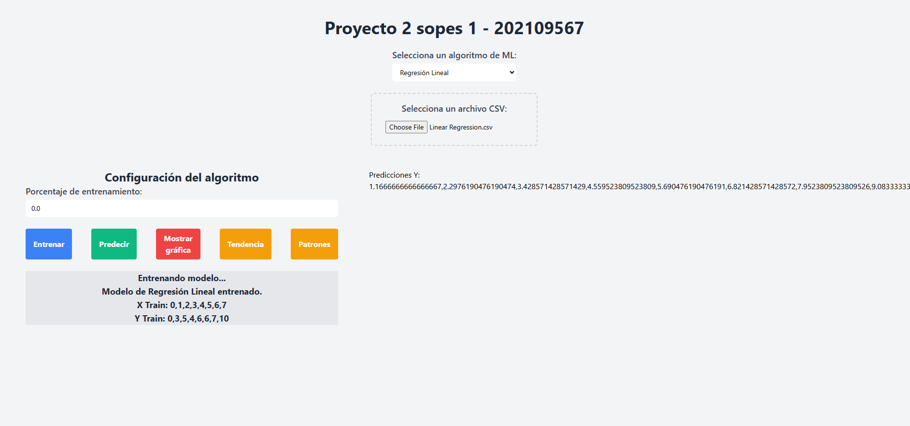
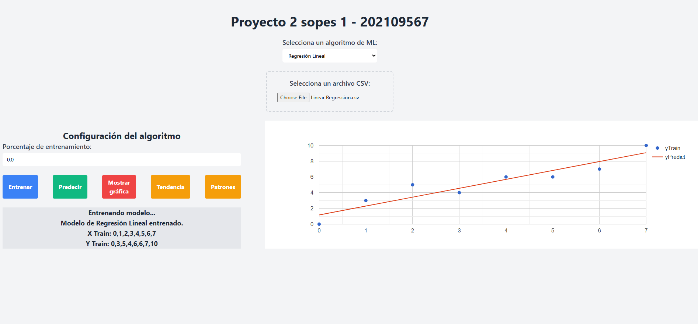
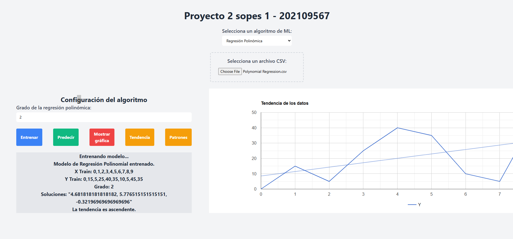
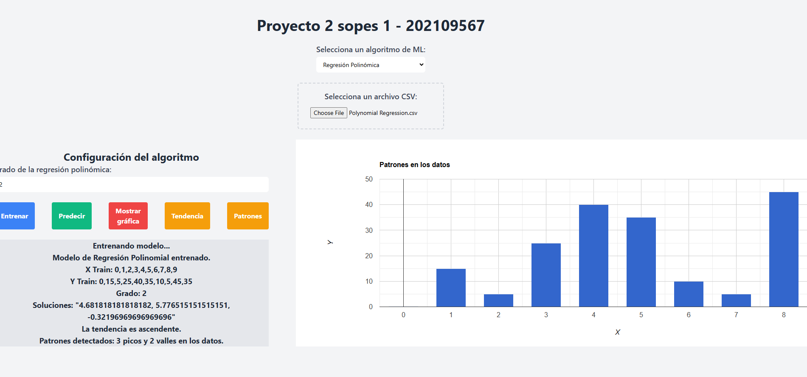

# Manual de usuario
Este manual esta orientado en el uso de la interfaz web de un sistema de machine learning, que permite cargar un archivo CSV, seleccionar un modelo de aprendizaje automático, configurar parámetros y realizar predicciones. Aquí se explican los pasos para operar cada función disponible en la interfaz.

## Descripción de la interfaz
La interfaz web cuenta con las siguientes secciones:
1. **Cargar archivo**: Permite seleccionar un archivo CSV desde el sistema de archivos local.
2. **Selección de modelo**: Muestra una lista de modelos de aprendizaje automático disponibles.
3. **Configuración de parámetros**: Permite configurar los parámetros del modelo seleccionado.
4. **Entrenamiento del modelo**: Permite entrenar el modelo con los datos cargados.
5. **Predicción**: Permite realizar predicciones con el modelo entrenado.
6. **Visualización de resultados**: Muestra los resultados de las predicciones realizadas.
  

## Selección de modelo

Para seleccionar un modelo de aprendizaje automático, se debe hacer clic en el menú desplegable y seleccionar el modelo deseado. Una vez seleccionado, se mostrarán los parámetros disponibles para configurar.

## Cargar archivo
Para cargar un archivo, se debe hacer clic en el botón "Seleccionar archivo" y seleccionar el archivo CSV deseado desde el sistema de archivos local. Una vez seleccionado, se mostrará el nombre del archivo cargado.

## Configuración de parámetros
Una vez seleccionado el modelo de aprendizaje automático, se mostrarán los parámetros disponibles para configurar. Se debe ingresar los valores deseados en los campos de texto o seleccionarlos de las listas desplegables.

## Entrenamiento del modelo

Para entrenar el modelo con los datos cargados y los parámetros configurados, se debe hacer clic en el botón "Entrenar modelo". Una vez completado el entrenamiento, se mostrará un mensaje indicando que el modelo ha sido entrenado con éxito.

## Predicción

Para realizar predicciones con el modelo entrenado, se debe hacer clic en el botón "Realizar predicción". Una vez completada la predicción, se mostrará un mensaje indicando que la predicción ha sido realizada con éxito.

## Patrones

Para realizar predicciones con el modelo entrenado, se debe hacer clic en el botón "Realizar predicción". Una vez completada la predicción, se mostrará un mensaje indicando que la predicción ha sido realizada con éxito.

